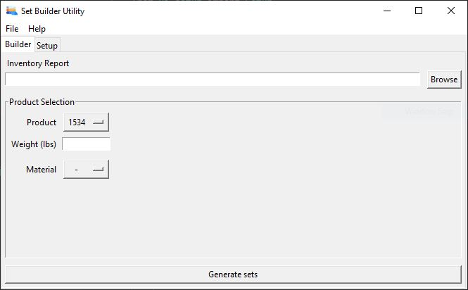
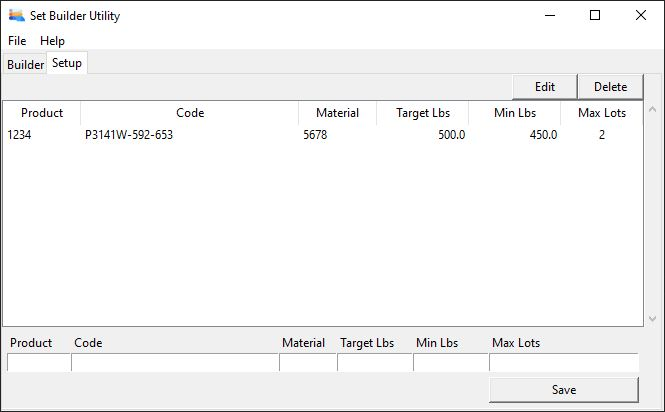

# Set Builder Utility

## About

This utility builds sets of finished goods based on a user-supplied inventory report and user selections. Sets are built in the user-specified order until the raw material list is exhausted. The tool attempts to select raw material rolls to make sets as close to the maximum allowable weight as possible.

## Installation
Download and run the latest release.

Note: This app stores data in a database.db3 file located in the user's home directory.

## Instructions for Use
### Generating Sets

1. Click "Browse", navigate to, and select the latest Inventory Report that you would like to build orders from
2. Select the Product from the dropdown in "Product Selection"
3. Enter the weight in lbs in the "Weight (lbs)" field
4. Select the Material in the "Material" dropdown to adjust what Material will be used to build the specified Product
5. Click "Generate sets" and wait for the utility to run.
6. The output of the utility will be added to a new sheet in the selected Inventory Report

Note: The inventory report cannot be open during set generation.

### Setup

#### To add new product configurations
 1. Fill in the fields at the bottom of the "Setup" tab
 2. Click "Save" and verify that a new line was added to the product list window

#### To delete product configurations

1. Highlight the product configuration to be deleted
2. Click "Delete" in the top-right corner of the window
    - Warning: Deletion occurs immediately and you will not be prompted to confirm the deletion. Undoing deleted configurations is not supported at this time.

#### To edit existing product configurations

1. Highlight the product configuration to be edited
2. Click "Edit" in the top-right corner of the window, the values will be populated into the entry fields at the bottom of the window
3. Make any desired edits
4. Click "Save" and verify that edits are updated in the product list window

## Issues or Feature Requests
Please submit issues [here](https://github.com/paulrunco/set-builder/issues) or email the author directly.

[Icon created by Freepik - Flaticon](https://www.flaticon.com/authors/freepik)