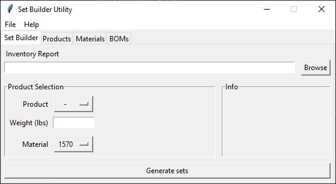

# Set Builder Utility

## About

This utility builds sets of finished goods based on a user-supplied inventory report and user selections. Sets are built in the user-specified order until the raw material list is exhausted. The tool attempts to select raw material rolls to make sets as close to the maximum allowable weight as possible.

## Installation
Download and run the latest release.

## Instructions for Use

1. Click "Browse", navigate to, and select the latest Inventory Report that you would like to build orders from
2. Select the product from the dropdown in "Product Selection"
3. Enter the weight in lbs in the "Weight (lbs)" field
4. If desired, change the "Material" dropdown to adjust what Material will be used to build the specified Product
5. Click "Generage sets" and wait for the utility to run.
6. The output of the utility will be added to a new sheet in the specified Inventory Report

## Issues or Feature Requests
Please submit issues [here](https://github.com/paulrunco/set-builder/issues) or email the author directly.
